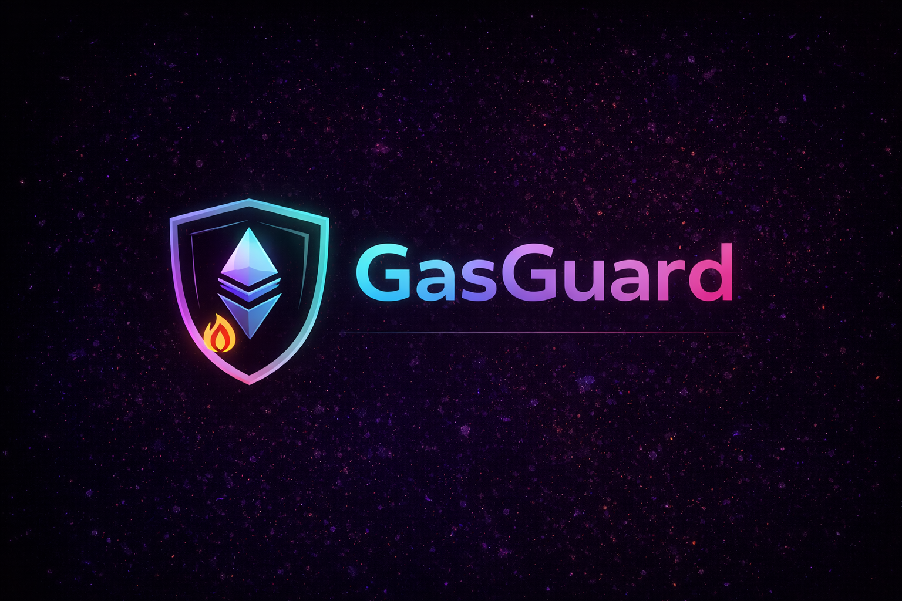
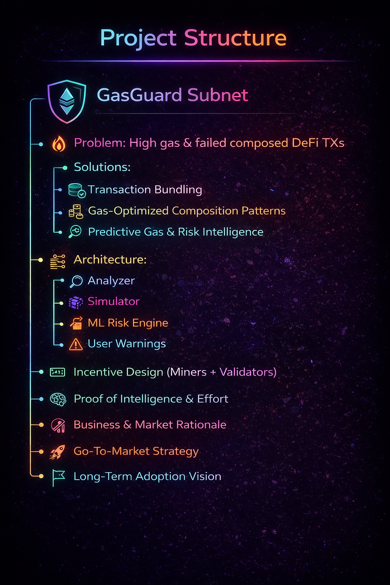
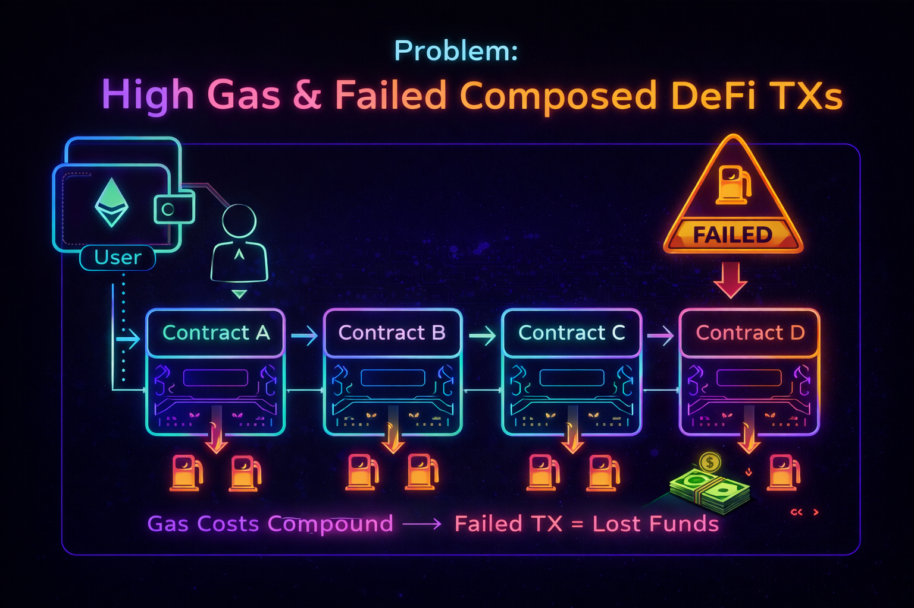
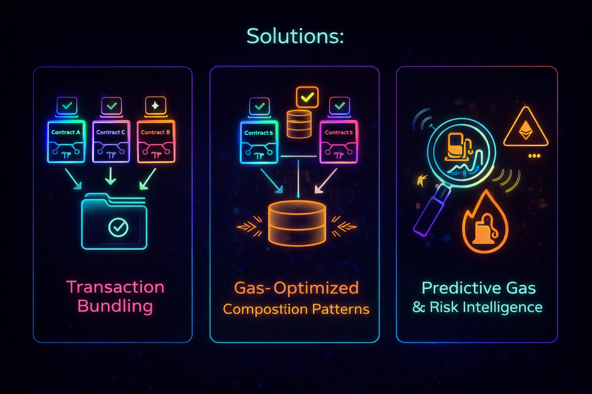
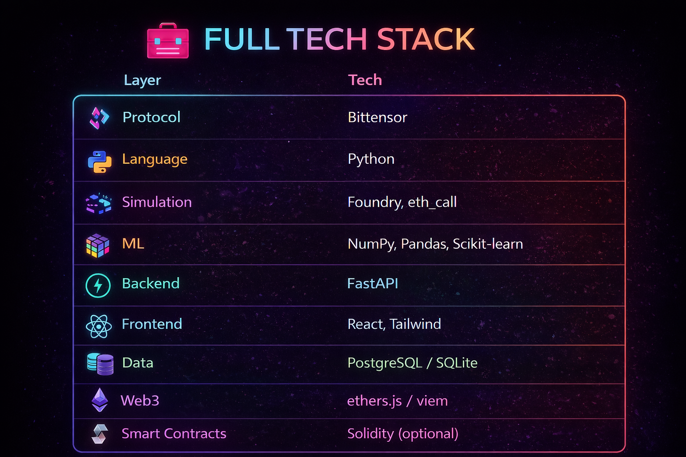

🛡️ GasGuard Subnet- Predictive Gas & Execution Risk Intelligence for Composed DeFi Transactions

> **A decentralized intelligence subnet that predicts gas cost, execution failure risk, and safety for complex composed DeFi transactions using miner-submitted simulations and validator-enforced scoring.**

---

<p align="center">
  
</p>

---

<p align="center">
  
</p>

---

🌌 Core Insight

DeFi composability is powerful — but costly.

As transactions span **multiple protocols**, gas usage becomes:

* ❌ unpredictable
* ❌ expensive
* ❌ failure-prone

Users often lose funds **even when transactions fail**.

> **GasGuard transforms this uncertainty into actionable execution intelligence — before the transaction is executed.**

---

🔥 The Problem Space

🔴 Problem 1: Each Contract Call Costs Gas
```
User
 → Contract A
 → Contract B
 → Contract C
 → Contract D
```

Each hop introduces:
* Function dispatch overhead
* Context switching
* Validation logic
* Storage access

**Impact**
* 💸 Gas costs grow rapidly
* 🐢 Execution becomes inefficient
* 😞 Users pay more for the same intent

---

🔴 Problem 2: Redundant Work Across Contracts

Protocols repeatedly:
* Re-check balances
* Re-validate permissions
* Re-read storage

Even when already verified earlier in the same transaction.

**Impact**
* 🔁 Duplicate computation
* 💸 Wasted gas
* ❌ No shared standards

---

🔴 Problem 3: Storage Operations Are Expensive

`SSTORE` is among the **most expensive EVM operations**.

Composed transactions often:
* Update balances in multiple contracts
* Persist intermediate states
* Overwrite the same slots repeatedly

**Impact**
* 📈 Gas spikes
* ⛔ Block gas limit failures
* 💀 Failed TXs still burn gas

---

<p align="center">
  
</p>

---

🛠️ Why Existing Solutions Aren’t Enough

✅ What Exists Today
* Local gas optimizations (protocol-specific)
* Layer 2 rollups (cheaper gas, same structure)
* Manual batching by developers

❌ What’s Missing
* System-level understanding of composed TXs
* Cross-protocol gas coordination
* Predictive tooling **before execution**
* Shared optimization standards

> **Current tools react after failure.
> GasGuard acts before execution.**

---

🚀 The GasGuard Solution

GasGuard does **not rewrite DeFi protocols**.
It provides **execution intelligence** that enables better decisions.

---

🚀 Solution Mapping

| Problem           | GasGuard Solution                  |
| ----------------- | ---------------------------------- |
| Too many calls    | Transaction Bundling               |
| Redundant checks  | Gas-Optimized Composition Patterns |
| Expensive storage | Predictive Gas & Risk Intelligence |

---

<p align="center">
  
</p>

---

🧠 Subnet Architecture

🔁 Textual Flow
```
Transaction Analyzer
        ↓
Gas Simulation Engine
        ↓
ML-Based Risk Analyzer
        ↓
User Warning / Recommendation
```
---

🖼️ Visual Architecture Diagram

👉 https://app.eraser.io/workspace/NkHOTU5CX8bUGDV0pzDZ (Open this in new tab) 

---

🧩 Core Components

🔍 Transaction Analyzer
* Extracts call depth
* Identifies protocol types
* Detects storage operations

⚙️ Gas Simulation Engine
* Forked chain simulations
* `eth_call`, Foundry (Anvil)

🧠 ML-Based Risk Analyzer
* Predicts failure probability
* Assigns risk class
* Learns from historical outcomes

⚠️ User Warning Layer
* Actionable gas & risk insights
* Wallet / API-friendly outputs

---

🎯 Incentive & Mechanism Design (Bittensor)

What the Subnet Produces
* ⛽ Gas estimates
* ⚠️ Failure probability
* 🚦 Risk classification
* 🧩 Failure reason attribution

---

🔁 High-Level Flow
```
User submits transaction
        ↓
Miners simulate & predict
        ↓
Validators evaluate quality
        ↓
Rewards distributed
```

---

🧮 Reward Logic

```
Reward ∝ Accuracy × Confidence × Timeliness × Reputation
```

* **Miners** → rewarded for accurate predictions
* **Validators** → rewarded for honest scoring

---

🧠 Proof of Intelligence / Proof of Effort

✅ Proof of Effort
* Real simulations
* Feature extraction
* Model inference

✅ Proof of Intelligence
* Better models → better rewards
* Learning compounds over time

> Rewards skill — not brute force or capital.

---

🔨 Miner Design
**Input**

* Encoded calldata
* Chain context

**Output**
```
{
  "estimatedGas": 180000,
  "failureProbability": 0.78,
  "riskLevel": "High",
  "confidence": 0.85
}
```

**Scoring Metrics**
* Accuracy
* Calibration
* Speed
* Consistency

---

🧪 Validator Design
* Reference simulations
* Cross-miner comparison
* Consensus-weighted scoring

---

💼 Business & Market Rationale

Why This Matters
* 💰 Millions lost in failed gas fees
* ❌ No neutral execution-risk oracle exists

Competition
* Centralized estimators
* Wallet heuristics
* Protocol-specific tools

**None are decentralized, composable, and incentive-aligned.**

---

🚀 Go-To-Market Strategy

Initial Users
* DeFi power users
* Wallet developers
* Yield aggregators

Distribution
* Wallet plugins
* APIs
* Dashboards

Bootstrappin
* Boosted early rewards
* Free risk queries
* Validator incentives

---

<p align="center">
  
</p>

---

🧱 Final Project Structure

```text
GasGuard Subnet
├── Problem: High gas & failed composed DeFi TXs
├── Solutions:
│   ├── Transaction Bundling
│   ├── Gas-Optimized Composition Patterns
│   └── Predictive Gas & Risk Intelligence
├── Architecture:
│   ├── Analyzer
│   ├── Simulator
│   ├── ML Risk Engine
│   └── User Warnings
├── Incentive Design (Miners + Validators)
├── Proof of Intelligence & Effort
├── Business & Market Rationale
├── Go-To-Market Strategy
└── Long-Term Adoption Vision
```

---

🌠 Long-Term Vision

GasGuard aims to become:
* The **execution safety layer** for DeFi
* A neutral, decentralized **risk oracle**
* A core primitive for wallets and protocols

---

⭐ If you like this idea, give the repo a star
🧠 Built for the future of DeFi composability
